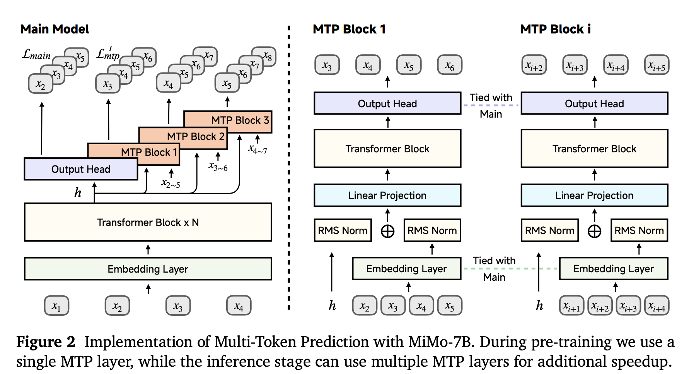

# MTP Training for Qwen

This repository contains training scripts for Multi-Token Prediction (MTP) based on the Qwen model. The goal is to accelerate inference of large language models by training them to predict multiple tokens at once.

This implementation is based on the [MiMo-MTP paper ](https://arxiv.org/pdf/2505.07608), which introduces a multi-token prediction framework to improve decoding efficiency without sacrificing accuracy.

## 🔧 Project Structure

- `train_qwen3_mtp.py` – Entry point for training the MTP model on Qwen.
- `mtp_qwen3.py` – Model extension/modification to support MTP heads.

## 📚 Reference

> **MiMo: MiMo: Unlocking the Reasoning Potential of Language Model – From Pretraining to Posttraining**   
> [arXiv:2505.07608](https://arxiv.org/pdf/2505.07608)

## 🧠 Method Overview

The following diagram illustrates the multi-token prediction (MTP) mechanism used in this implementation:

  
Fig.1 – An overview of the MTP architecture adapted for Qwen.

## 📈 Results

The following results are based on top-k sampling inference using three MTP heads. The model was trained on Qwen with MiMo-style supervision.

| Sampling Method | MTP1 Accept | MTP2 Accept | MTP3 Accept | Speedup |
|-----------------|-------------|-------------|-------------|---------|
| Top-k Sampling  | 0.53        | 0.37        | 0.32        | 2.60×   |

> *Acceptance rate* indicates how often draft tokens are accepted, and *speedup* measures decoding efficiency.

## 💻 Requirements

- Python 3.8+
- PyTorch >= 2.0
- Transformers (Hugging Face)
- Datasets
- Qwen model weights
